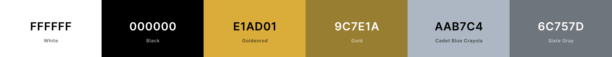

# Milestone Project 4 - Cook's Finest

View live project [here]()

Cook's Finest is an online e-commerce store, offering a collection of kitchenware for the savy home cook. User's can create their own account, saving their details for faster checkout for future purchases, but are not limited, and can make a purchase as a guest if wanted. The registered user can edit their personal details and access their shopping history. Blogs are presented for good reads, and a newsletter sign up is offered.

***

## Table of Contents

* [What does it do and what does it need to fulfill?](#what-does-it-do-and-what-does-it-need-to-fulfill)
  * [Project Goals](#project-goals)
* [User Experience](#user-experience)
  * [User Goals](#user-goals)
  * [User Stories](#user-stories)
  * [Site Owner Goals](#site-owner-goals)
* [Design](#design)
  * [Research](#research)
  * [The Five Planes of UX](#the-five-planes-of-ux)
    * [Wireframes](#wireframes)
    * [The Colour Scheme](#the-colour-scheme)
    * [Font](#font)
    * [The Logo](#the-logo)
    * [Conclusion](#conclusion)
* [Technologies Used](#technologies-used)
* [Database Structure](#database-structure)
* [Features](#features)
  * [Existing Features](#existing-features)
  * [Future Features](#future-features)
* [Testing](#testing)
* [Deployment](#deployment)
  * [Local Deployment](#local-deployment)
  * [Deployment to Heroku](#deployment-to-heroku)
* [Credits](#credits)
  * [Content](#content)
  * [Code](#code)
  * [Media](#media)
* [Acknowledgements](#acknowledgements)
* [Special Thanks](#special-thanks)
* [Disclaimer](#disclaimer)

***

## **What does it do and what does it need to fulfill?**

This is my fourth and final milestone project of Code Institute's Full-Stack Web Developer Course. The projects main requirements were to build a Django web application with the use of HTML, CSS, JavaScript and Python, and utilising a relational database, allowing users to store and manipulate data records of a particular domain. This was achieved with the user profile model, where user's can add and edit their personal details, as well as the site owner having the ability to add, edit and delete products from the site.
The use of Stripe was also a requirement, which I fulfilled with the use of a checkout system for user's to purchase their selected product(s).
IMPORTANT: The Stripe API used for handling payments is currently only for educational purposes and is not for taking real card payments. To test the payment functionality successfully, use the test card number Stripe provides, of "4242 4242 4242 4242", and then the other details chosen at random.
This project is a Django-Python web application, plugged into a PostgreSQL database, with SQLite3 used in the development, and was deployed using Heroku. The Bootstrap framework and grid system was used for effective styling across the pages of the site.

### **Project Goals**

My goal was to supply the home cook with a website where they can browse and purchase products they want for their home kitchen, and provide helpful tips and ideas on how to improve the kitchen space.

***

## **User Experience**

### User Stories

Due to the the quantity of user stories for this project, and for best practice, I compiled my user stories on a spreadsheet to make it more clear which story is related to what and who.

Please view the user stories spreadsheet [here](https://github.com/Gregory4321/cooks_finest/blob/master/media/readme_content/user-stories.png)

[Back to Top](#table-of-contents)

***

## **Design**

### Research

Reasearching for this project, I came across only a handful of sites that catered only for kitchen products. The design and layouts of the sites kept a clear and to-the-point attitude about them. Colours were kept very neutral as the images of the products on display were to be kept at the fore front of the site.

Sites I used for inspiration were:

* [Robert Dyas](https://www.robertdyas.co.uk/)
* [Lakeland](https://www.lakeland.co.uk/)
* [Wayfair](https://www.wayfair.co.uk/)
* [ProCook](https://www.procook.co.uk/)
* [Sous Chef](https://www.souschef.co.uk/)
* [Amazon](https://www.amazon.co.uk/)
* [Dunelm](https://www.dunelm.com/)

### The Five Planes of UX

#### The Strategy Plane

Afer researching other kitchen products and accessories websites, I noticed that the competition was spread. There were only a few sites that focused solely on kitchen equipment, where a lot of other sites were more braod, offering products not just relevant to kitchens. I wanted to create a site where the home cook could come to find the product(s) they wanted for their kitchens. I wanted an environment that purely focused on this area, and enhanced their cooking knowledge through informative blogs of ideas and tips. I wanted each user to have the ability to create theor own account, provide and securelystore their personal information, with the option to edit and remove that information, and make purchases.

#### The Scope Plane

With deciding on my app idea, and what type of user would use it, I really considered what features would be beneficail to the user, and what would make this a successful and easily useable site. I knew the main feature would be the ability to purchase a product through a secure checkout. I wanted the user to be able to easily sort and search through the products, adding product to the basket, and then having the ability to securely checkout. I also wanted the user to utilise the blog posts, learning cooking tips provided, as well as subcribing to a newsletter through entering their email address. I wanted users to be notified of their actions along the way, such as bag updates, success and error messages.

#### The Structure Plane

Once I had decided what features I wanted to include, I began the think about the structure of the site. I wanted to keep the presentation clean, and make use of margins to keep content well organised. I wanted all site users to easily search for a product, using keywords but also a sorting system to sort by category, and then each or multiple categories by sorted to meet the user's needs. I used bootstraps grid system to help clearly present the content of the pages. I wanted a nav bar that would change accordingly to whether the user was an external user or logged in user. From this, to better the user experience, I decided that upon clicking 'My Account' on the nav bar, an external user would see login and register, but a logged in user would see profile and logout. For the store owner, signed in as a superuser, would see the profile and logout options, but also product management option too. With this, the store owner would also see the option to edit and/or delete products from the individual product details page, and also from the products pages.

#### The Skeleton Plane

At this level, I really thought about how a user would navigate around the site. I wanted a clear structure throughout the site. Each page would have a fixed navbar and footer that was consistent and the ease of navigation across the site was enhanced further with breadcrumb navigation and call to action buttons. A user always needed an easy way to return home, so the use of a breadcrumb navigation would appear once the user navigated away from the home page. This also give's the user the ease of returning to the previous page(s) with ease. The call to action buttons would be used to direct the users to shop now, taking them to the all products page, or to the corresponding blog page. Here the user will find images as links to open specific blogs. There is also a call to action to open a specific special offer.

Upon opneing the website, The user would immediately see the my account text (or just the icon if on mobile) and have access to the register or login pages. These pages would present a form depending on what page the user clicked, and a link to direct them to the other if they clicked the wrong link to begin with. Regardless of which form was completed, the user is directed to the home page to encourage immediate shopping. From the homepage, the user can also clearly see the menu bar, or hamburger on smaller screens, and have access to navigate between specific product category pages of the site. The search bar provided in the navbar would further aid the user, using the keyword used and navigating to a specific area or category.
I wanted content hinting on the home page to encourage the user to scroll down the page, accessing best selling products. A back to top button would also appear across all pages that scrolled past a certain point, aiding ease of use for the user, to return to the top with a click instead of having to scroll all the way back to the top.
The user's profile page would consist of accordions to present the users details and order history in a cleaner way. This would avoid any overwhelming of content and information, and keep the area's broken up.

#### The Surface Plane

From the beginning of my research, I had discovered that e-commerce sites would be very colourful, no matter what, due to the colurful content of product images. Because of this I wanted to keep the design simple, and not have overpowering colours that would clutter the site. The volume of content of an e-commerce site could easily make a site feel too busy, so I wanted to design this site so that a user could effortlessly navigate the site. Having researched and thought over the design process thoroughly, I created a workspace on Figma. I had initially sketched ideas onto paper, so now I could start to bring them to life. I created all the pages I had planned for desktop and mobile screen sizes, clearly showing how the structure of the content would mould together on the different sizes, creating more enhanced wireframes.

Find the links to these wireframes below.

Wireframes

* Base Template
  * [Desktop View](https://github.com/Gregory4321/cooks_finest/blob/master/media/readme_content/base-wire.png)
  * [Mobile View](https://github.com/Gregory4321/cooks_finest/blob/master/media/readme_content/mob-base-wire.png)
* Home Page
  * [Desktop View](https://github.com/Gregory4321/cooks_finest/blob/master/media/readme_content/home-wire.png)
  * [Mobile View](https://github.com/Gregory4321/cooks_finest/blob/master/media/readme_content/mob-home-wire.png)
* Products Page
  * [Desktop View](https://github.com/Gregory4321/cooks_finest/blob/master/media/readme_content/products-wire.png)
  * [Mobile View](https://github.com/Gregory4321/cooks_finest/blob/master/media/readme_content/mob-products-wire.png)
* Individual Product Page
  * [Desktop View](https://github.com/Gregory4321/cooks_finest/blob/master/media/readme_content/product-wire.png)
  * [Mobile View](https://github.com/Gregory4321/cooks_finest/blob/master/media/readme_content/mob-product-wire.png)
* My Account Page
  * [Desktop View](https://github.com/Gregory4321/cooks_finest/blob/master/media/readme_content/profile-wire.png)
  * [Mobile View](https://github.com/Gregory4321/cooks_finest/blob/master/media/readme_content/mob-profile-wire.png)
* Login Page
  * [Desktop View](https://github.com/Gregory4321/cooks_finest/blob/master/media/readme_content/login-wire.png)
  * [Mobile View](https://github.com/Gregory4321/cooks_finest/blob/master/media/readme_content/mob-login-wire.png)
* Register Page
  * [Desktop View](https://github.com/Gregory4321/cooks_finest/blob/master/media/readme_content/register-wire.png)
  * [Mobile View](https://github.com/Gregory4321/cooks_finest/blob/master/media/readme_content/mob-register-wire.png)
* My Basket Page
  * [Desktop View](https://github.com/Gregory4321/cooks_finest/blob/master/media/readme_content/basket-wire.png)
  * [Mobile View](https://github.com/Gregory4321/cooks_finest/blob/master/media/readme_content/mob-basket-wire.png)
* Checkout Page
  * [Desktop View](https://github.com/Gregory4321/cooks_finest/blob/master/media/readme_content/checkout-wire.png)
  * [Mobile View](https://github.com/Gregory4321/cooks_finest/blob/master/media/readme_content/mob-checkout-wire.png)
* Contact Page
  * [Desktop View](https://github.com/Gregory4321/cooks_finest/blob/master/media/readme_content/contact-wire.png)
  * [Mobile View](https://github.com/Gregory4321/cooks_finest/blob/master/media/readme_content/mob-contact-wire.png)
* Blog Home Page
  * [Desktop View](https://github.com/Gregory4321/cooks_finest/blob/master/media/readme_content/blog-wire.png)
  * [Mobile View](https://github.com/Gregory4321/cooks_finest/blob/master/media/readme_content/mob-blog-wire.png)
  

[Back to Top](#table-of-contents)

##### The Colour Scheme

I wanted to use monochromatic styling for this site effectively, as the strong tonal variation provides a good contrast between the areas of the page. I wanted a brighter colour to pop out from the black and white, to enhance areas of activity like call to actions buttons, the delivery banner and the back to top button. This colour scheme would prove useful as the content of the site was to potentially be bright and busy, so this monochromatic style helped to break up these areas.

The colours I used are:

The primary colour, Goldenrod(yellow), was used for areas I wanted to pop out to the user, such as the delivery banner, back to top button, and text colour on hover of particular elements, as well as buttons background colour when hovered over, across pages. Using the colour tool that appears when hovering over a colour set in the style.css page, I toned down this colour to obtain the colour used for the basket icon when it is already coloured Goldenrod when there are items in the basket, giving a clear contrast for the user that their cursor is over the basket icon.

The secondary colour I chose was Black. This was to provide clear contrast when used alongside the backgound of the pages(White), and the primary colour(Goldenrod). The main nav was coloured black, with the top nav above being white, and the promotional banner below, yellow. Therefore, the text of the main nav is white, and changes to yellow when the user hoveres over it. The main buttons across the site were also coloured black, again with white text, and the yellow on hover. Text colour across the entire rest of the site is black so that it stands out against the white background. Exceptions to this include the placeholder text of the forms(#aab7c4), small sub headings, and the category and rating text of the products description (all coloured in Bootstraps text-muted class, #6c757d).

I also used Bootstraps success, danger, warning and info colours as toast colour indicators, as well as the primary class for the edit link presented to the superuser, with the delete link colour as danger.

##### Font

I decided on two fonts for my site. I found them using [Google Fonts](https://fonts.google.com/), and refining the search criteria to sans serif fonts. I found the Quiksand font, which I thought would work well as the body font, as it was simple and easy to read. I used Google Fonts inbuilt tool to find popular pairings for the Quiksand font, and the Montserrat font was suggested. I found that this font was a perfect pairing for the body font I'd chosen, as it was very similar, yet stood out more as headings and titles and to the point.
I included these fonts by inserting a link taken from google fonts into the head of my base.html.

##### The Logo

For this project, I decided to keep the logo as a basic h2 heading, in black font to keep a theme across the site. I wanted to use a basic design and structure for this as I felt a fancy designed logo for this site wasn't neccassarily needed, and the h2 would help with the transitioning of different screen sizes.

#### Conclusion

The final pages...

[Back to Top](#table-of-contents)

***

## **Technologies Used**

### Languages

* [HTML5](https://en.wikipedia.org/wiki/HTML5) - Language used to create the structure of the pages.

* [CSS3](https://en.wikipedia.org/wiki/Cascading_Style_Sheets) - Language used to add styling across all pages.

* [JavaScript](https://en.wikipedia.org/wiki/JavaScript) - Language used to create interactivity across the pages.

* [Python](https://en.wikipedia.org/wiki/Python_(programming_language)) - Language used to create the back-end functionality of the app.

### Libraries, Frameworks and Editors

* [Django](https://www.djangoproject.com/) -  a high-level Python Web framework that encourages rapid development and clean, pragmatic design.

* [Bootstrap 5](https://getbootstrap.com/) - used as the base structure and layout of the site, using its grid system to aid responsiveness across screen sizes. Many components such as the navbar, footer and cards were used. Bootstraps inbuilt Javascript and jQuery was used for initialization of many components such as the dropdown elements and the navbar expand and collapse.

* [jQuery](https://jquery.com/) - utilising it's extensive library to simplify and help writing Javascript code.

* [Google Fonts](https://fonts.google.com/) - used to embed the 'Montserrat' and 'Quiksand' fonts used across the site.

* [Font Awesome](https://fontawesome.com/) - used for their free range of icons.

* [Favicon.io](https://favicon.io/) - was used to generate the favicon image.

* [Gitpod](https://www.gitpod.io/) - used as preferred choice of IDE for writing my code. Halfway through this project gitpod upgraded their IDE to [Visual Studio Code](https://code.visualstudio.com/) which I then continued using as the main IDE to write my code.

* [Git](https://git-scm.com/) - used for version control by making use of the Gitpod terminal to add, commit and push to Github.

* [Github](https://github.com) - used to host the project's repository and store the code, and linked to Heroku to push latest changes to the deployed build version.

* [Heroku](https://www.heroku.com/) - used as a hosting platform for deploying my live version of this CRUD application.

* [Unsplash](https://unsplash.com/) - used to find images for use across the site.

* [Google Images](https://google.com) - used to find images for use across the site.

### Extensions and Packages

* [Django allauth](https://django-allauth.readthedocs.io/en/latest/index.html) - used as an authentification system, utilising it's templates and logics.

* [Django Crispy Forms](https://django-crispy-forms.readthedocs.io/en/latest/) - used to format forms, automatically using Bootstrap styling.

* [Pillow](https://pillow.readthedocs.io/en/stable/) - Python Imaging Library to help store imagery into a database.

* [psycopg2](https://www.psycopg.org/docs/) - PostgreSQL database adapter for the Python.

### Databases

* [Sqlite 3](https://www.sqlite.org/index.html) - used as the database during development.

* [PostgresSQL](https://www.postgresql.org/) - used as the database for deployment, enabling it as an add on through [Heroku](https://www.heroku.com/postgres).

### Tools

* [Stripe](https://stripe.com/gb) - used as the payment infrastructure to take payments on the site.

* [Google](https://www.google.co.uk/) - used for researching various techniques, styles and information.

* [Google Chrome DevTools](https://developers.google.com/web/tools/chrome-devtools) - used for testing and debugging.

* [Figma](https://www.figma.com/) - used for creating the wireframes in the design stage.

* [Coolors](https://coolors.co/) - used to find and compare colours that complimented one another, retrieve names of colours, and showcase
the colours on the README.md file as an image.

* [Canva](https://www.canva.com/) - used to design and create the logo and favicon logo.

* [Picresize](https://picresize.com/) - used to resize and crop images for better implementation, such as 25% or 50% smaller.

* [Am I Responsive](http://ami.responsivedesign.is/) - used for showing the responsiveness of the site across different screen sizes and providing the image at the top of this document.

* [Free Online HTML Formatter](https://www.freeformatter.com/html-formatter.html#ad-output) - used to format the HTML code in a neater and more organised fashion.

* [Free Online CSS Formatter](https://www.freeformatter.com/css-beautifier.html) - used to format the CSS code in a neater and more organised fashion.

* [Free Online JS Formatter](https://www.freeformatter.com/javascript-beautifier.html) - used to format the JavaScript code in a neater and more organised fashion.

[Back to Top](#table-of-contents)

***

## **Database Structure**

During the development of this Django project, I worked with the SQLite3 database, which is the default database used by Django. For deployment of this project, I changed to a PostgreSQL database, that is provided by Heroku as an add-on.

Using Django Allauth and it's default `django.contrib.auth.models`, provided me with the the **User model** used in the profile app.

The structure of the Product and Checkout apps are guided by the Code Institute's walkthrough project, **Boutique Ado**.

### Data Models

#### Profile app

##### UserProfile model

| Name             | Database Key         | Field Type           | Validation                                          |
| ---------------- | -------------------- | -------------------- | --------------------------------------------------- |
| User             | user                 | OneToOneField 'User' | on_delete=models.CASCADE                            |
| Full Name        | default_full_name    | models.CharField     | max_length=50, null=True, blank=True                |
| Phone Number     | default_phone_number | models.CharField     | max_length=20, null=True, blank=True                |
| Street Address 1 | street_address1      | models.CharField     | max_length=80, null=True, blank=True                |
| Street Address 2 | street_address2      | models.CharField     | max_length=80, null=True, blank=True                |
| Town or City     | default_town_or_city | models.CharField     | max_length=40, null=True, blank=True                |
| County           | default_county       | models.CharField     | max_length=80, null=True, blank=True                |
| Postcode         | default_postcode     | models.CharField     | max_length=20, null=True, blank=True                |
| Country          | default_country      | models.CharField     | blank_label='Select Country', null=True, blank=True |

#### Products app

##### Category model

| Name             | Database Key         | Field Type           | Validation                                          |
| ---------------- | -------------------- | -------------------- | --------------------------------------------------- |
| Name             | name                 | CharField            | max_length=254                                      |
| Friendly Name    | friendly_name        | CharField            | max_length=254, null=True, blank=True               |

##### Product model

| Name             | Database Key         | Field Type           | Validation                                                   |
| ---------------- | -------------------- | -------------------- | ------------------------------------------------------------ |
| Category         | category             | models.ForeignKey    | 'Category', null=True, blank=True, on_delete=models.SET_NULL |
| Sku              | sku                  | models.CharField     | max_length=254, null=True, blank=True                        |
| Name             | name                 | models.CharField     | max_length=254                                               |
| Price            | price                | models.DecimalField  | max_digits=6, decimal_places=2                               |
| Sizes            | has_sizes            | models.BooleanField  | default=False, null=True, blank=True                         |
| Description      | description          | models.TextField     |                                                              |
| Rating           | rating               | models.DecimalField  | max_digits=6, decimal_places=2, null=True, blank=True        |
| Image            | image                | models.ImageField    | null=True, blank=True                                        |
| Image URL        | image_url            | models.URLField      | max_length=1024, null=True, blank=True                       |

#### Checkout app

##### Order model

| Name                     | Database Key         | Field Type           | Validation                                                   |
| ----------------         | -------------------- | -------------------- | ------------------------------------------------------------ |
| Order Number             | order_number         | models.CharField     | max_length=32, null=False, editable=False                    |
| User Profile             | user_profile         | models.ForeignKey    | UserProfile, on_delete=models.SET_NULL, null=True, blank=True,related_name='orders' |
| Full Name                | full_name            | models.CharField     | max_length=50, null=False, blank=False                       |
| Email                    | email                | models.EmailField    | max_length=254, null=False, blank=False                      |
| Phone Number             | phone_number         | models.CharField     | max_length=20, null=False, blank=False                       |
| Country                  | country              | CountryField         | blank_label='Select Country *', null=False, blank=False      |
| Postcode                 | postcode             | models.CharField     | max_length=20, null=True, blank=True                         |
| Town or City             | town_or_city         | models.CharField     | max_length=40, null=False, blank=False                       |
| Street Address 1         | street_address1      | models.CharField     | max_length=80, null=False, blank=False                       |
| Street Address 2         | street_address2      | models.CharField     | max_length=80, null=False, blank=False                       |
| County                   | county               | models.CharField     | max_length=80, null=True, blank=True                         |
| Date                     | date                 | models.DateTimeField | auto_now_add=True                                            |
| Promotion Cost           | promotion_cost       | models.DecimalField  | max_digits=6, decimal_places=2, null=False, default=0        |
| Order Total              | order_total          | models.DecimalField  | max_digits=10, decimal_places=2, null=False, default=0       |
| Grand Total              | grand_total          | models.DecimalField  | max_digits=10, decimal_places=2, null=False, default=0       |
| Original Basket          | original_basket      | models.TextField     | null=False, blank=False, default=''                          |
| Stripe Payment Intent ID | stripe_pid           | models.CharField     | max_length=254, null=False, blank=False, default=''          |

##### Order Line Item model

| Name                     | Database Key         | Field Type           | Validation                                                   |
| ----------------         | -------------------- | -------------------- | ------------------------------------------------------------ |
| Order                    | order                | models.ForeignKey    | Order, null=False, blank=False, on_delete=models.CASCADE, related_name='lineitems' |
| Product                  | product              | models.ForeignKey    | Product, null=False, blank=False, on_delete=models.CASCADE   |
| Product Size             | product_size         | models.CharField     | max_length=2, null=True, blank=True                          |
| Quantity                 | quantity             | models.IntegerField  | null=False, blank=False, default=0                           |
| Line Item Total          | lineitem_total       | models.DecimalField  | max_digits=6, decimal_places=2, null=False, blank=False, editable=False |

#### Blog app

##### BlogPost model

| Name         | Database Key | Field Type           | Validation                                                 |
| ------------ | ------------ | -------------------- | ---------------------------------------------------------- |
| Title        | title        | models.CharField     | max_length=254, unique=True                                |
| Date Created | created_on   | models.DateTimeField | auto_now_add=True                                          |
| Date Updated | updated_on   | models.DateTimeField | auto_now= True                                             |
| Slug         | slug         | models.SlugField     | max_length=254, unique=True                                |
| Author       | author       | models.ForeignKey    | User, on_delete= models.CASCADE, related_name='blog_posts' |
| Body         | body         | models.TextField     |                                                            |
| Image        | image        | models.ImageField    | null=True, blank=True                                      |
| Image URL    | image_url    | models.URLField      | max_length=1024, null=True, blank=True                     |
| Status       | status       | models.IntegerField  | choices=STATUS, default=0                                  |

#### Reiviews app

##### Product Review

| Name         | Database Key   | Field Type           | Validation                                                           |
| ------------ | -------------- | -------------------- | -------------------------------------------------------------------- |
| Product Name | product        | models.ForeignKey    | 'products.Product', null=True, blank=True, on_delete=models.SET_NULL |
| User Profile | user_profile   | models.ForeignKey    | UserProfile, on_delete=models.SET_NULL, null=True, blank=True,related_name='user_review' |
| Date Created | created_on     | models.DateTimeField | auto_now_add=True                                                    |
| Title        | review_title   | models.CharField     | max_length=254                                                       |
| Content      | review_content |  models.TextField    | max_length=1000, null=False, blank=False, default=''                 |

[Back to Top](#table-of-contents)

***

## **Features**

### Existing Features

Navigation Bar:
All pages consist of a fixed nav bar visible at all times. It features a search box on the left to search keywords of a products name and description, and the sites logo in the middle. To the right two icons, one to represent a dropdown menu for 'my account', and a basket total which is a clickable link to the basket page. The 'my account' dropdown reveals different options depending who the user is. If a user is not signed in, 'login' and 'register' links are offered. Once a user is signed in, a link to 'my profile' and 'logout' is offered, as well as a box telling the user who is signed in. If the user is a superuser, they will also see a 'product management' link to take them to the corresponding page. Below this 'top nav', is the main navigation of the site. Here the user can click on links opening a dropdown menu, reealing more links to specific areas and categories of the site. The entire nav is fully responsive, with the logo being removed on tablet screen sizes and below, and the main nav moving to a collapsible hamburger menu on the left. The search bar is still present, but is revealed upon clicking a search icon, to keep the site on smaller screens feeling too busy.

Footer:
As with the navigation bar, all pages consist of a page footer. Here the user can click social media icons foind in the center of the footer, taking them to the corresponding social media pages. To the left of these icons a disclaimer is displayed that the site is for educational purposes, and to the right a clickable link taking the user to the contact page.

Landing Page:
A hero image showcases the type of products a user will find on the site. A jumbotron houses a call to action button to encourage the user to shop now, directing them to the all products page. Upon scrolling below the hero image, two cards with image backgrounds and overlaying text offer call to action buttons to the blog and special offers pages. Below this, 6 cards offer an insight of new arrivals to the site, presented as clickable card links to the products.

Products Pages:
Products can be viewed in various different ways, either as all products of the entire site, all products of a chosen category, or products of a specific sub category. Each of these pages follow the same layout and design to maintain consistency. Products are presented fully responsive cards, using Bootstraps grid system, containing the products image, as a link to the product, the products title and price, the category and rating. The category is presented as a clickable badge, taking the user to said category page. A dropdown menu is offered at the top right of the page above the products, to sort the products in different ways. : 'Price (low to high)/(high to low)', 'Name (A-Z)/(Z-A)' and 'Rating (low to high)/(high to low)' and 'Category (A-Z)/(Z-A)'. If the user is a superuser, then edit/delete buttons are offered in each product card for ease of management.

Product Details Page:
Individual products are viewed on this page, with the image to the left, and details to the right. The details are presented the saem as the products card on the products pages, along with the products description. A quantity selector box is given on this page for the user to input manually or use selector buttons (+/-) to increase/decrease the quantity of the respective product. There are two buttons below this for the user to go back to the all products page to 'Continue Shopping', or 'Add to Basket' to add the product to the user's basket.The edit/delete buttons are presented here also to only a superuser. If any products on the enitre site contain a size, then a dropdown above the quantity selector box is presented for the user to select as size. 'M' for medium is selected by default.

Profile Page:
This page is accessed through the dropdown of the 'My Account' link from the navbar. HEre a user is presented with a simple accordion. The first dropdown of the accordion will be open by default, and holds a form of the users default delivery information, which will be empty for the first time, and then updated whenever an order is placed and details are entered into the checkout form. The user can also update their details here by filling in the ofrm and clicking the 'Update Information' button belwo the form. The second dropdown holds the users order history. This is presented as a simple table, showing the order number, date, items and order total. The order number is given as the forst 5 digits of the unoquie number, and can be hovered over to reveal the entire number, and clicked to take the user to that orders confirmation page.

Basket Page:
This page lists to the user everything they have added to their basket. Basic product information is shown, along with a quantity selector box for the user to ammend their order. There is an update button to update the given quantity, and a remove button to completely remove the product fromt their basket. The basket total is given at the bottom right of the page, followed by the total discount if applicable, and then the grand total. If the user has not hit the discount threshold, text is shown informing how much more the user needs to spend to get the discount. If that threshold is hit, then the logic is executed to deduct the discount from the basket total, ammending the grand total to match. There are two buttons below this, one to 'Continue Shopping' taking the user back to all products, and the other the procedd to the checkout page.

Checkout Page:
The checkout page is split into two columns.To the right is a brief order summary, giving the user a final opportunity to check thier basket. On the left, a form to enter personal and delivery information. If the user is a new user, then the form will be empty. If the user has palced an order previously, or entered their information on the profile page, then the form will be pre filled with what was entered last time. Below the form, a checkbox offers the user to save the (if any) input information to their profile, and if not logged in then links to create an account or login are presented. An input box is then found to input the users payment method. Finally, there are again two buttons, one to go back to adjust user's basket, and one to complete their order. Upon clicking 'Complete Order', a yellow overlay takes the screen with a spinning gif indicating the order is being placed.

Checkout Success Page:
This page is accessed once a user completes an order. but can also be accessed through the profile page by clicking on the order umber from their 'Order History'. Here, the user will have a summary of their order, a confiramtion message of the successfully placement of the order, and a button to check out the lastest deals, to encourage further shopping. If accessing this page through their order history, a user will be notifued that they are viewing a past confirmation.

Blog Page:
The user can access this page by clicking on the card from the home page. All users have access to view thedse blogs, enhancing user interactivity with the site. The page kept a simple view to keep interaction for the user easy. Individual blogs will be presented as cards, with the image to the left, and then the title, a glimpse of the blogs body content limitied to 150 characters, and created by and on details. Below this a button to open the respective blog. The cards on this page are fully responive to the diferent screen sizes, moving the image to above the text on tablet screen sizes and less. If the user is a super user, then an add blog button will be present above the cards to the right.

Blog Details Page:
The individual blog pages have been kept simple, and fully responsive on different screen sizes. When opened from the blog page, they are opened in a seperate window to keep a good flow to the site, in case a user wanted to open multiple blogs. This page presents the blogs image, if any, then the title, created by and on details, and the blogs content. If the user is the supersuser, then links to edit/delete will be visible below the created by and on details.

Review Views:
ENTER HERE WHEN CREATED

Back to top button:
A back to top button becomes visble across all pages when a user scrolls past 200 pixels. The colour changes to the yellow from the colour scheme when hovered over, and when click, scrolls at a set speed back to the top of the page.

### Future Features

***

## Testing

***

## **Deployment**

***

### Local Deployment

To run your own version of this project, it can be cloned or downloaded from Github

***

### Deployment to Heroku

To deploy this project to Heroku:

***

## **Credits**

### Content

### Code

### Media

***

## **Acknowledgements**

### Pages used for inspiration

### Pages used for information

### Special thanks

## **Disclaimer**

This project was created for educational use only. It has been part of studying at the Code Institute as part of their Full Stack Web Developer Course.
