# Testing

[back to README.md file](https://github.com/Gregory4321/cooks_finest/blob/master/README.md)

## Table of Contents

- [Validators](#validators)
  - [W3C Validators](#w3c-validators)
  - [JSHint Validator](#jshint-validator)
  - [pylint-django](#pylint-django)
  - [Markdown](#markdown)
- [User Story Testing](#user-story-testing)
- [Manual Testing](#manual-testing)
- [Bugs](#bugs)
- [User Testing](#user-testing)

---

## Validators

This project was put through vigorous testing. Throughout development, I manually tested along the way as I built the website to identify any bugs, and then once deployed, I enhanced the testing process using automatic testing in the form of validators.

### W3C Validators

The W3C Markup Validator and W3C CSS Validator Services were used to validate the code on all of the pages across all apps, and to make sure that there were no syntax errors in the project.

- [W3C Markup Validator](https://validator.w3.org/)
- [W3C CSS Validator](https://jigsaw.w3.org/css-validator/)

#### CSS

All css files passed through the validator with no errors.

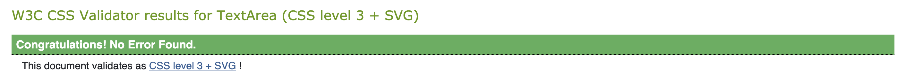

#### HTML

When running the html code through the validator there appeared to be a pattern of reoccurring errors. These errors were flagged from the use of Django templating logic in the html code, so these errors could be overlooked as they were not a true error.

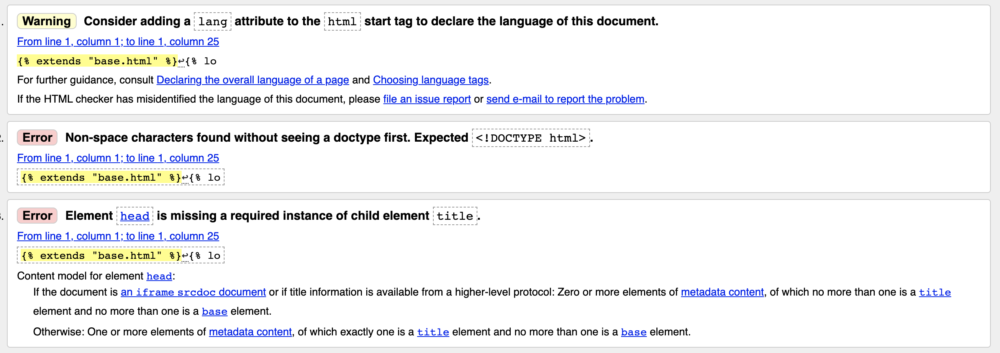

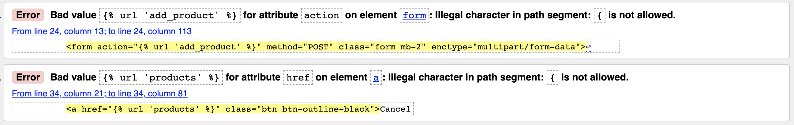

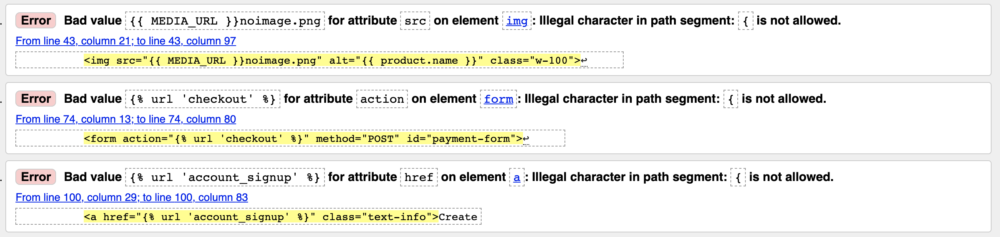

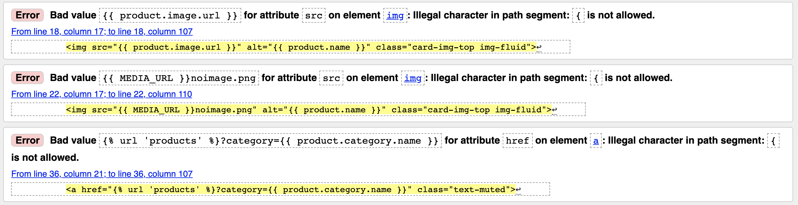

#### JavaScript

All js files were tested automatically using JSHint. No errors were given from this, just advice on missing semicolons and warnings of let being available in ES6. Other than this minor issues, all js files and scripts passed.

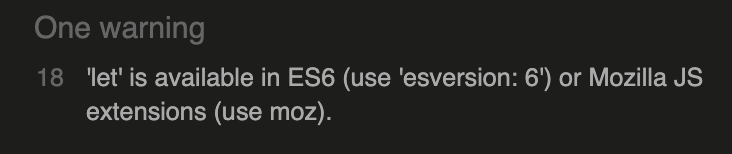

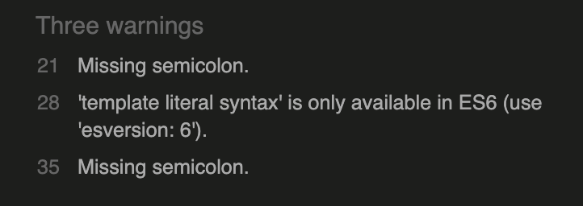

#### Python

The pylint-django extension was installed to the workspace through the command line. This was a great tool to check that all python code had no errors, and over come any code that was tripping up due to Django syntax. I had to create a settings.json file to load the plugs of pyint-django, enabling it to work properly. This straight away resolved some of the issues I had appearing in Django syntax. The special character must be escaped error was removed, and the Class ‘’ has no ‘objects’ member was resolved for all of these occurences.

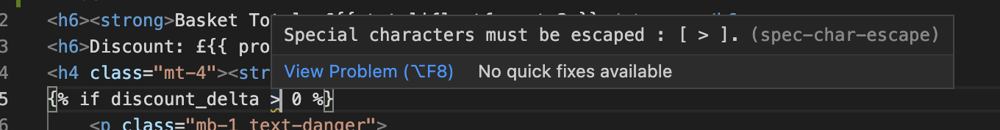

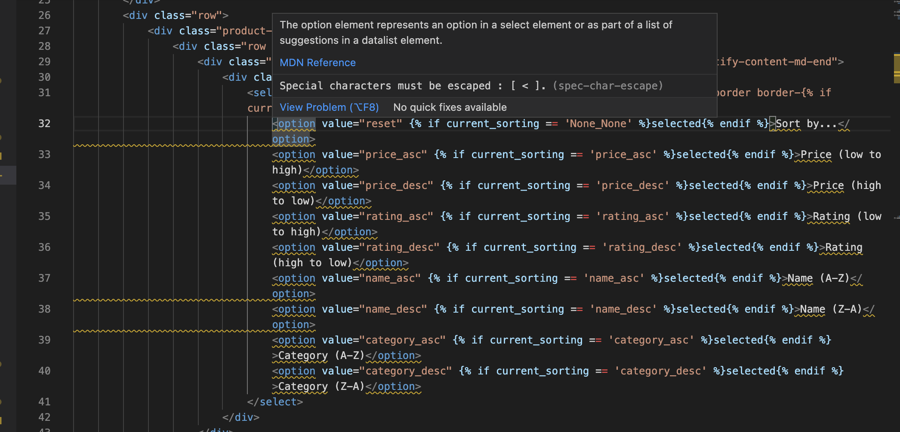

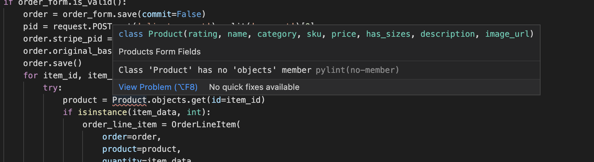

It also indicated simple errors that were highlighted due to pylint-django requirements. These were easily rectified by executing what it suggested.

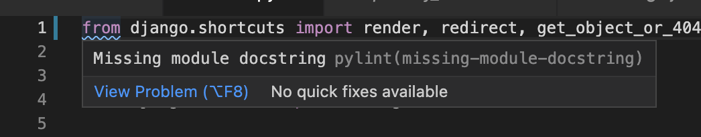

#### Markdown

To conform with markdown requirements I installed the markdown-lint extension. This was another great tool for ensuring all markdown content conformed and its syntax was correct. It indicated some errors that were not there before. I know these errors were void as I used them in my previous project and were taken from the markdown GitHub, so creating a markdownlint.json file, I was able to disable these errors.

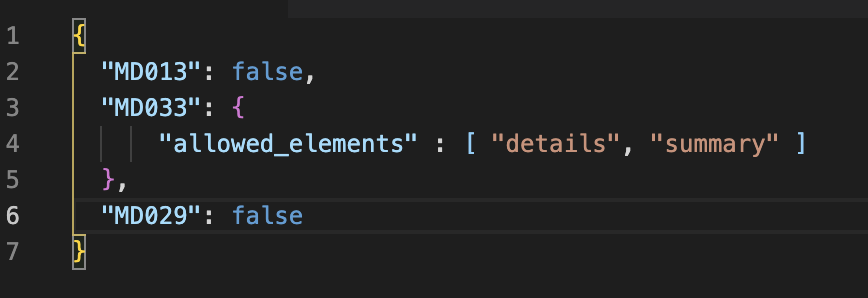

---

## User Stories Testing

### Viewing and Navigation

1. As a site user, I want to be able to view a list of products so that I can select a product(s) to purchase.

- A user is presented a grid system of cards containing the products images, title, price, category and rating.

2. As a site user I want to be able to view a specific category of products so that I can quickly find products Im interested in without having to search through all products.

- A user is provided a clear navigation bar to direct them to categories of products or all products, as well as a call to action from the home page, all rendering a grid system of products clearly presented with images, their title, price, category and rating.

3. As a site user, I want to be able to view individual product details so that I can learn more about the product, seeing its image, price description and rating.

- Once a user has clicked the card of a product, a product detail page is rendered revealing all details of an individual product.

4. As a site user, I want to be able to easily pinpoint special offers so that I can save money on purchases.

- The navigation bar gives the user a direct link to take them to all special offers on the site.

### Registration and user accounts

5. As a site user, I want to be able to easily register for an account so that I can have a personal account and my own profile.

- A user is presented with a my account nav link, where the can select register from the dropdown, taking them to basic registration form.

6. As a site user, I want to be able to easily login and logout so that I can access my personal account information and securely logout.

- As like the registration link in the my account nav link, a user is presented with a link to take them to the login form. Upon logging in the are directed to their profile page. Once logged in from the same nav link, a user can click logout to then confirm on the next page and logout.

7. As a site user I want to be able to easily recover my password in the event I forget so that I can recover access to my account.

- From the login form page, a user can click a link to reset their password, giving them an input field to fill in with their email address to send a link to change their password.

8. As a site user I want to be able to receive a confirmation email after registration so that I can verify that my account registration was completed and successful.

- Upon registration to the site, a user will receive a confirmation email giving them a link to confirm their account registration.

9. As a site user I want to be able to have a personalised user profile so that I can review my previous orders, and save payment and delivery information.

- Each registered user gets their own profile page, accessible from the my account dropdown nav link. A users profile is presented in a nice collapsible accordion, separating the two sections, default delivery details and order history. Payment details are saved when a user places an order and selects save info, updating the delivery details accordingly.

10. As a site user I want to be able to subscribe to the sites newsletter so that I can stay up to date with upcoming offers.

- Unfortunately, I was not able to complete these section of the site, so there is no link to subscribe to a newsletter.

### Sorting and Searching

11. As a site user I want to be able to sort the list of available products so that I can easily establish the best priced and best rated products, and search products by category.

- Using the main navigation bar available across all pages, a user can sort products by each required field.

12. As a site user I want to be able to sort a specific category of products so that I can find the best priced and best rated product in a specific category, or sort the products in that category by name.

- On each product page, the user has access to a sort selector box that they can change the input using the dropdown to sort the selected categories products by price, rating and name.

13. As a site user I want to be able to sort multiple categories of products simultaneously so that I can find the best priced and best rated product across categories such as “cookware” or “tableware”.

- On each product page, the user has access to a sort selector box that they can change the input using the dropdown to sort the products by category.

14. As a site user I want to be able to search for a product by name or description so that I can find a specific product.

- Visible across all pages of the site, a search bar is visible for the user to enter a query, search all products names and descriptions for their queried word.

15. As a site user I want to be able to easily see what I’ve search for and the number of results so that I can quickly decide whether the product I want is available.

- After each search query, above the presented products to the left, a user can find the details of their search query and how many products match that query.

### Purchasing and Checkout

16. As a site user I want to be able to easily select the size and quantity of a product I want to purchase, if applicable so that I can ensure I select the correct size and quantity.

- A user is presented with clear input fields to select the quantity using increment and decrement buttons, and the size as a dropdown option.

17. As a site user I want to be able to view the items in my basket so that I can see what I am purchasing and the total cost.

- A user can direct to the basket page by clicking the basket icon from the navbar. Here they can clearly see each added item spread out as a table with the subtotal at the end, and then the order total at the bottom of the page.

18. As a site user I want to be able to adjust the quantity of individual items in my basket so that I can effortlessly make changes before checkout.

- From the basket page, a use can the same selector box as when adding the products quantity to change the amount of each product, clicking an update button to update the quantity.

19. As a site user I want to be able to easily enter my payment details so that I can complete my purchase with no worries.

- When a user is checking out they can enter their payment details by filling out a simple form, that will indicate any invalid inputs before submission.

20. As a site user I want to be able to view an order confirmation after checkout so that I can check I made no mistakes when checking out.

- When an order is completed, a user is directed to a checkout success page, render their order details. They can also access this page form their profile page and clicking the order number form their order history.

21. As a site user I want to be able to receive an order confirmation after secure checkout so that I can keep a record of my purchases.

- A user will receive an email confirmation containing all of their order details, as well as accessing the confirmation form their order history section of their profile.

### Admin and Store Management

22. As a store owner I want to be able to add a product so that I can add new products to my store.

- A store owner can add a product by signing in as their superuser account, clicking the my account nav link, and click product management. This will render a page with a form to add the products details and add a product to the site.

23. As a store owner I want to be able to edit a product so that I can change a products details.

- Signed in as a super user, the store owner will see an edit link in the product details from the products page and product details page. This will take them to an edit product form where they can change the details and update the product.

24. As a store owner I want to be able to delete a product so that I can delete a product that is no longer available for purchase.

- The same as the edit link, a delete link is presented to the superuser on both the products and products detail pages to delete a product. A modal popup will be initiated to conform the deletion of a product.

25. As a store owner I want to be able to add a blog post so that I can provide the site user’s with tips and trick.

- From the my account nav link, a blog management link is provided in the dropdown. This will render a page with a form to add a blog to the site.

26. As a store owner I want to be able to edit a blog post so that I can change and/or correct a blog post.

- Signed in as a super user, the store owner will see an edit link in the blog details section from the blog posts page and blog details page. This will take them to an edit blog form where they can change the details and update the blog.

27. As a store owner I want to be able to delete a blog post so that I can keep the most relevant blog posts circulating.

- The same as the edit link, a delete link is presented to the superuser on both the blog posts and blog detail pages to delete a blog. A modal popup will be initiated to conform the deletion of a blog.

---

## Manual Testing

Manual testing was thorough throughout the development of this site, but once I deployed I gave it a once over and manually tested the entire deployed site.

### Navigation Bar

#### Desktop View

- Search bar - Searches the database use the query as a key word and returns any products that have the keyword in their title or description

- Logo - returns the user to the home page

- My Account Link - reveals a dropdown menu:

  - If not authenticated:

    - Register - directs the user to the registration page

    - Login - directs the user to the login page

  - If user is authenticated:

    - My Profile - directs the user to their own unique profile page

    - Logout - directs the user to the home page

  - If user is a superuser:

    - Product Management - directs the user to the add product page

    - Blog Management - directs the user to the add blog page

- Basket Link - directs the user to the basket page, changes to yellow upon hover, and solid yellow when something is in the basket

#### Mobile View

- Hamburger icon - activates a dropdown main navigation menu:

  - Home button - directs the user back to the home page

  - Category buttons - reveals a further dropdown container the categories categories

- Search icon - reveals a dropdown search bar, with the same functionality as the desktop search bar

- My account Icon - reveals a dropdown with the same functionality as the desktop view

- Basket icon - directs the user to the basket page

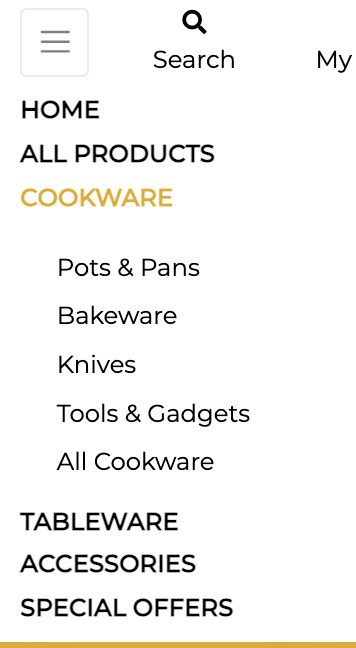

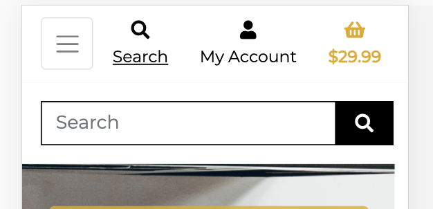

### Footer

#### Desktop and Mobile View

- Social icons - directs the user to the corresponding social media sites

- Contact Us link - directs the user to the contact form page

  - On destop, upon hover of the social icons and contact link they turn yellow

  - On mobile, upon clicking the social icons and contact link they turn yellow

### Back to Top Button

#### Desktop and Mobile View

- Back to top button - appears on the bottom right of the screen after user scrolls past 200 pixels

  - Clicking this button inverts the colours and takes the user with a set scroll speed to the top of the page

All of these features are present across every page of the site.

---

### Home Page

#### Desktop and Mobile View

All call to action buttons text colour change to yellow when hovered over.

- Hero image jumbotron "Shop Now" CTA - Directs the user to the all products page

- Blog card "Go There" CTA - Directs the user to the all blogs page

- Special offers card "Shop Now" CTA - Directs the user to the all special offers page

- New Arrivals section

  - See all link - directs the user to the all special offers page

  - Product cards

    - Product image links to individual product detail page

    - Product category link - directs the user to that categories all product page

  - If superuser, edit and delete buttons are presented at the bottom of the cards inline with the rating

    - Edit link - directs the superuser to the edit product page

    - Delete link - brings up a modal asking to confirm delete

      - Delete modal

        - Cancel button - closes the modal and keep the user on the same page

        - Delete button - removes the product from the database

### Profile Page

#### Desktop and Mobile View

- Accordion headers

  - Title underlines and cursor hand appears when hovered over

  - Opens and close the section of the accordion

- User Details

  - Presents a form with placeholders

  - Update Information button - updates the default delivery information

- Order History

  - Order number hover reveals full order number

  - Order number link - directs the user to their past confirmation page

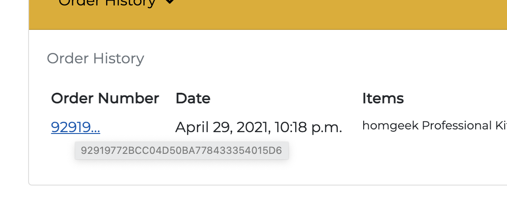

### Products Pages

#### Desktop and Mobile View

- Product's Home link - if a user accesses this page through a search query, a link at the top left directs them back to the all products page

- Sort selector box - allows the user to sort the products by price, rating, name or category, ascending to descending, A to Z

- Product cards

  - Product image links to individual product detail page

  - Product category link - directs the user to that categories all product page

- If superuser, edit and delete buttons are presented at the bottom of the cards inline with the rating

  - Edit link - directs the superuser to the edit product page

  - Delete link - brings up a modal asking to confirm delete

    - Delete modal

      - Cancel button - closes the modal and keep the user on the same page

      - Delete button - removes the product from the database

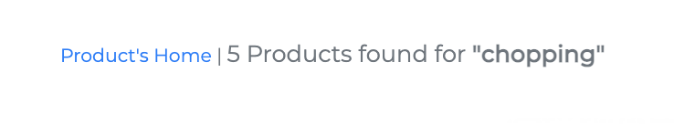

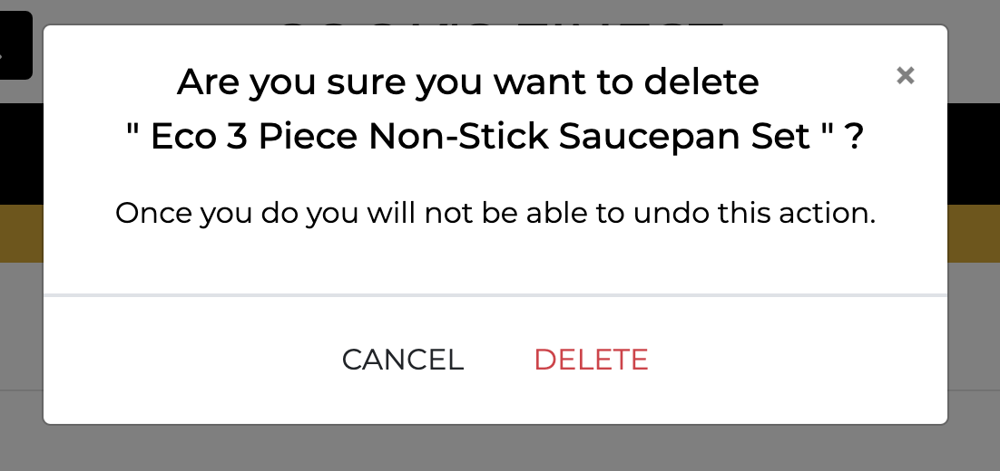

### Product Detail Page

#### Desktop and Mobile View

- Product category link - directs the user to that categories all product page

- If superuser, edit and delete buttons are presented inline with the rating above the product description

  - Edit link - directs the superuser to the edit product page

  - Delete link - brings up a modal asking to confirm delete

    - Delete modal

      - Cancel button - closes the modal and keep the user on the same page

      - Delete button - removes the product from the database

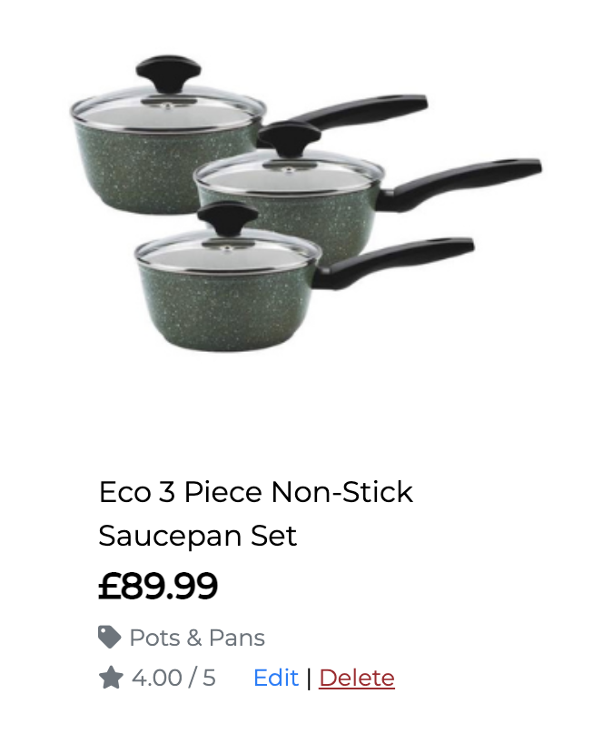

- Quantity selector box - allows a user to increase or decrease the quantity of the product to their basket

  - The user can use the -/+ buttons, or the up/down button inside the box, or manually input a figure

- Size dropdown (if applicable) - reveals a dropdown where the user can select a size of the chosen product

- Continue Shopping button - directs the user to the all products page

- Add to basket button - adds the selected product to the basket

- Add reviews link - plus icon turns yellow when link is hovered over - directs the user to the add review form page

- Read reviews page - reveals a dropdown of card(s), rendering a no reviews yet card, or all reviews as individual cards for that product

### Basket Page

#### Desktop and Mobile View

- Quantity selector box - allows a user to increase or decrease the quantity of the product in their basket

  - The user can use the -/+ buttons, or the up/down button inside the box, or manually input a figure

- Update link - updates the quantity after using the selector box - underlined when hovered on

- Remove link - removes the product from the users basket - underlined when hovered on

- Continue Shopping button - directs the user to the all products page

- Secure Checkout button - directs the user to the checkout page

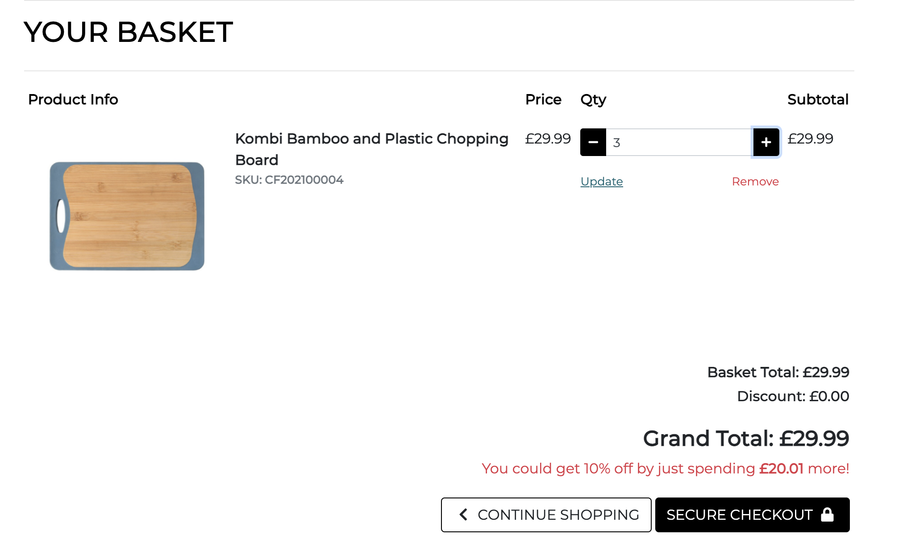

### Checkout page

#### Desktop and Mobile View

- Delivery form on the left. Order summary on the right

- If user is not logged in

  - Form is presented empty and fields contain placeholders indicating what to fill in

  - Below the form links to sign up or login - direct the user to the corresponding pages

- If user is logged in and completed an order form before or entered default delivery details on profile page - form is pre filled will previous entered details

  - Checkbox below form - when checked will save these details of the form as the default delivery details

- Payment box - linked with stripe to use its default card details input box

  - If there is an error inputting your card details a warning appears

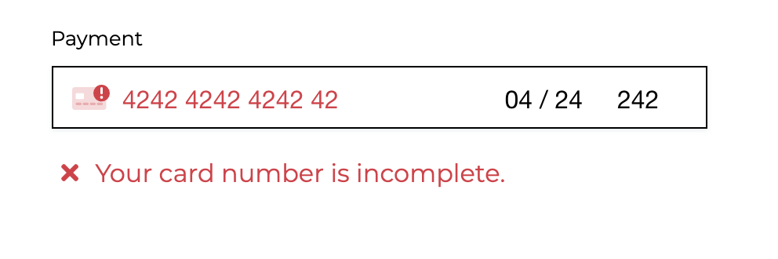

- Adjust Basket button - directs the user back to their basket

- Complete Order button - complete the order process

  - A yellow overlay takes the screen with a loading spinner icon until the order is complete

- If basket is empty

  - Continue Shopping button - directs the user to the all products page

### Checkout Success Page

#### Desktop and Mobile View

- Confirmation box with all entered details to the form presented

- Button - directs the user to the all special offers page

### Contact Page

- Form on the left - placeholders indicating what each input is

- Send Message button - directs the user back to the home page

### Toast Messages

- When the user adds a product to their basket

  - Success toast message contains all the products in the basket, have the ability to scroll through them

  - Secure Checkout button - directs the user to the basket page

- Discount status - indicates to the user how much more to spend to get discount on their order

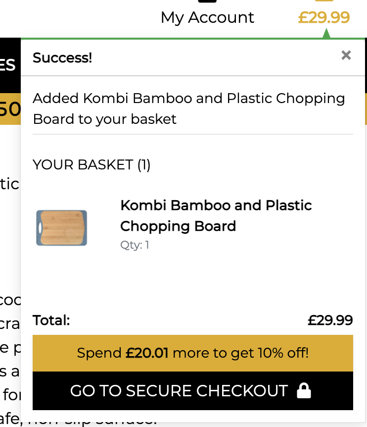

### Blog Posts Page

#### Desktop and Mobile View

- Stacked blog post cards

  - If superuser, edit and delete buttons are presented at the bottom of the cards inline with the rating

  - Edit link - directs the superuser to the edit product page

  - Delete link - brings up a modal asking to confirm delete

    - Delete modal

      - Cancel button - closes the modal and keep the user on the same page

      - Delete button - removes the product from the database

  - Card image, title and "Read More" button - directs the user to the blog post detail page

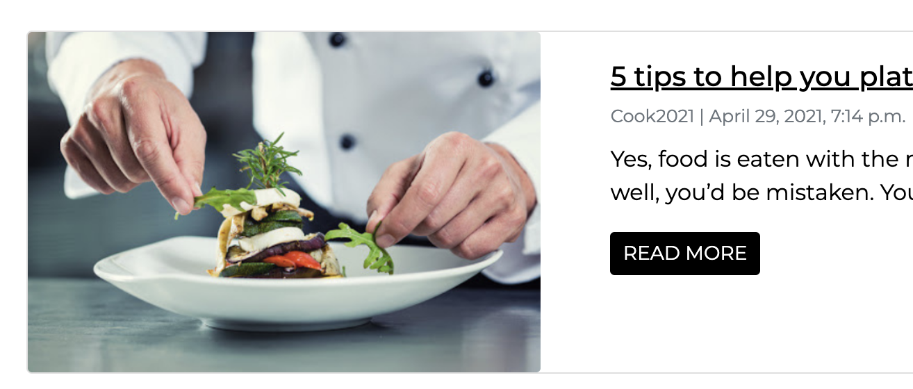

### Blog Detail Page

#### Desktop and Mobile View

- Blog detail page opens as a new tab

- If superuser, edit and delete buttons are presented at the bottom of the cards inline with the rating

  - Edit link - directs the superuser to the edit product page

  - Delete link - brings up a modal asking to confirm delete

    - Delete modal

      - Cancel button - closes the modal and keep the user on the same page

      - Delete button - removes the product from the database

## Bugs

Before discovering the pylint-django extension, I tried to fix the special characters must be escaped linting error by using character entities. Unfortuantely this threw another error

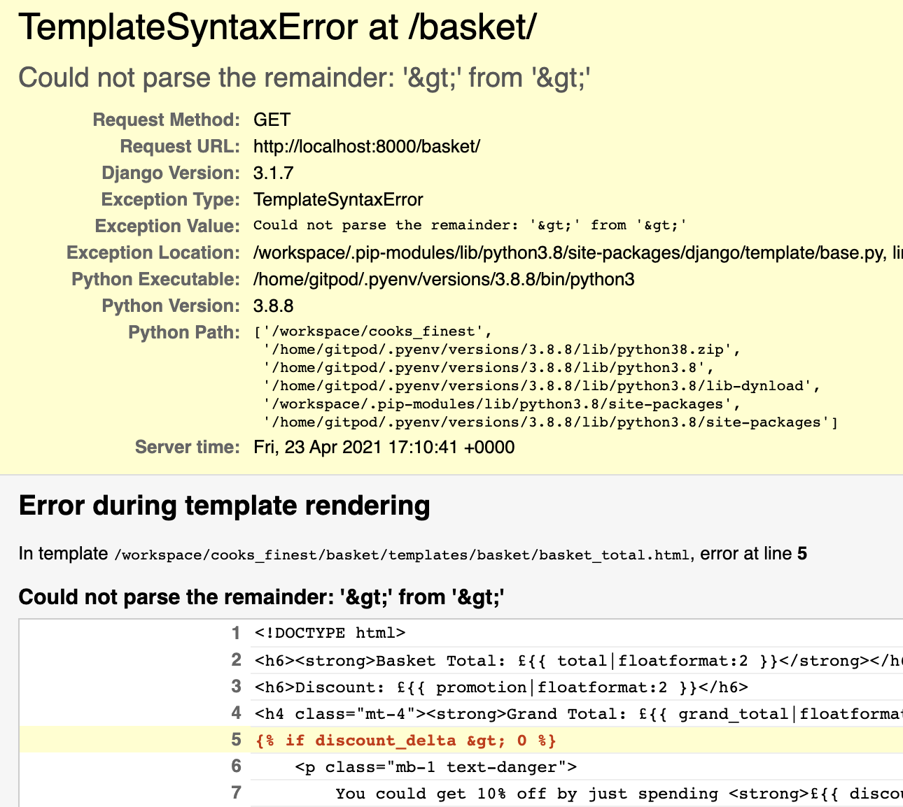

During the implementation of the quantity selector box of the basket page, I was having trouble with the right side of the box when a product with a size was added. This was a simple fix where I discovered I was missing a curly bracket.

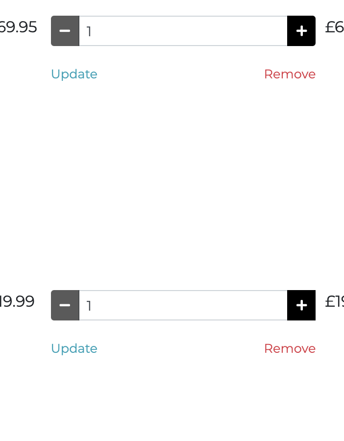

Upon ispection of the home screen on smaller sizes, I found that the content below the jumbotron was not full width and got smaller the smaller the screen size got. Upon thorough investigation and help from a fellow slack member I discovered that where I had set the jumbotrons width to 450 pixels, it meant that the rest of the page content got squashed once the screen resolution fell below 450 pixels. For this I changed the width of the jumbotron and gave it media queries for the smaller screen sizes.

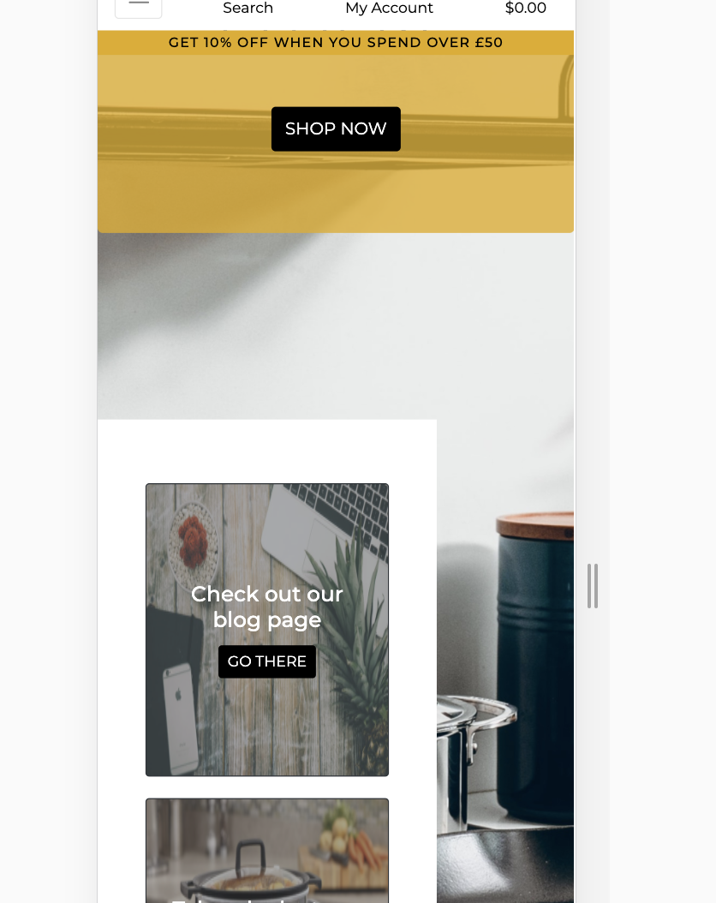

A bug occurred when I was trying to add a review to a product. I had the logic all in place, but soon discovered that I had put the calculate_rating function outside of the product model, so it was not being called properly, and threw an error.

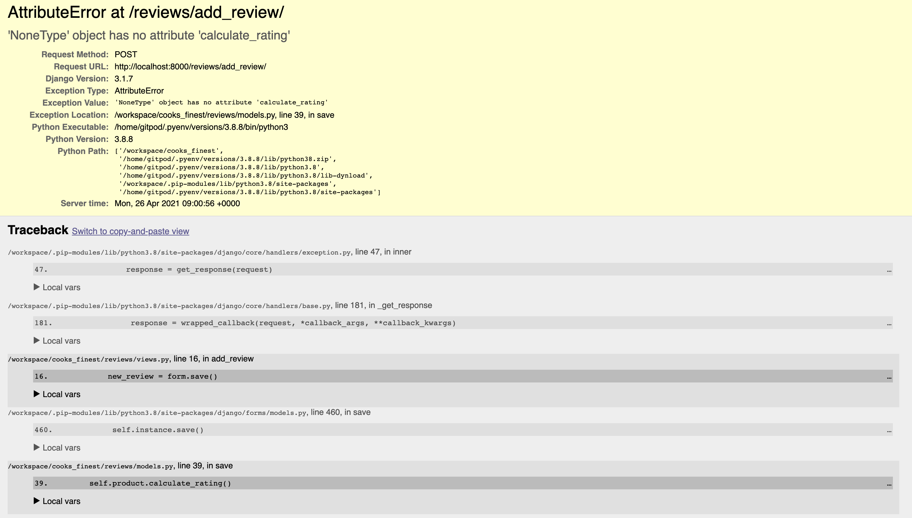
